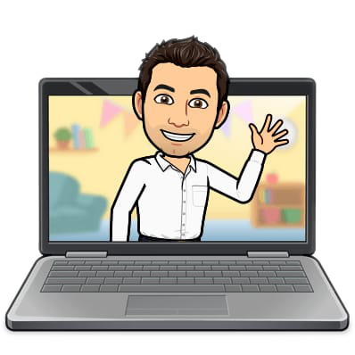

 

 # Hola, ¿cómo estás? Soy Néstor Arias Cataldi
## `Full Stack Developer`. Graduado en [`Henry`](https://www.soyhenry.com/). En ella aprendí todo lo relacionado a `PERN stack`, y a trabajar en equipo siguiendo metodologías ágiles como `SCRUM`. 
## A lo largo de los años pude desarrollar capacidades como gran tenacidad en la resolución de los problemas, pensamiento crítico y una necesidad de aprendizaje continuo; otorgando a Empresas resulados positivos. 
## Gracias por su atención.

> [PERN](https://es.acervolima.com/que-es-pern-stack/): Esta pila consta de PostgreSQL, Express, React y Node.js. Combinando estas tecnologías, se puede construir una aplicación web de pila completa con operaciones CRUD. 

> [SCRUM](https://es.wikipedia.org/wiki/Scrum_(desarrollo_de_software)): Es un marco de trabajo para desarrollo ágil de software que se ha expandido a otras industrias.

------
# Tecnologías aprendidas:

<table align="center">
  <tr>
  <td>

  </td>
  <td>

  </td>
  <td>

  </td>
  <td>

  </td>
  <td>

  </td>
  <td>

  </td>
  <td>

  </td>
  <td>

  </td>
  <td>

  </td>
  <td>
 
  </td>
  <td>

  </td>
  </tr>
</table>

------
# Contacto:

<table align="left" border="none">
  <tr>
  <td>
  </td>
  <td>

  </td>
  <td>
  </td>
  <td>

  </td>
  </tr>
</table>

<!--
**nariascataldi/nariascataldi** is a ✨ _special_ ✨ repository because its `README.md` (this file) appears on your GitHub profile.

Here are some ideas to get you started:

- 🔭 I’m currently working on ...
- 🌱 I’m currently learning ...
- 👯 I’m looking to collaborate on ...
- 🤔 I’m looking for help with ...
- 💬 Ask me about ...
- 📫 How to reach me: ...
- 😄 Pronouns: ...
- ⚡ Fun fact: ...
-->
